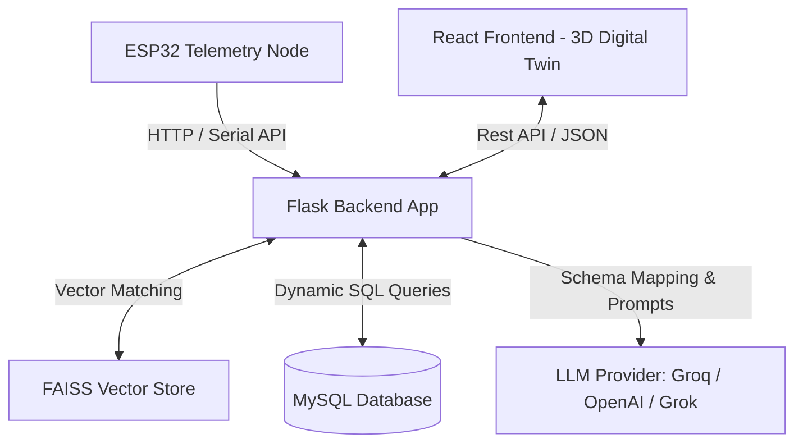

# SmartHome Cortex: AI-Driven Digital Twin & RAG Agent Portal

**🌐 Live Demo**: [https://smart-home-event-summarization.vercel.app](https://smart-home-event-summarization.vercel.app)

SmartHome Cortex is a state-of-the-art, full-stack home automation and monitoring platform. It integrates an immersive **3D Spatial Digital Twin** (built using React, Three.js, and Framer Motion) with a **Retrieval-Augmented Generation (RAG) AI Assistant** (powered by LangChain, FAISS, and LLM APIs like Groq/OpenAI/Grok) that dynamically translates plain English into SQL queries to query and control real-time device telemetries.

Additionally, the system features a hardware integration pipeline connecting **ESP32 energy monitoring nodes** directly to a secure MySQL database.

---

## 🚀 Key Features

- **3D Spatial Digital Twin**: An interactive 3D digital representation of the home layout allowing users to monitor live room statuses (AC, TV, washing machine, lights, fans) with dynamic room-focused camera navigation.
- **RAG-Powered Conversational AI**: A natural language chat assistant that converts user queries (e.g., *"How much energy did the AC in Room 3 consume today?"* or *"Turn off the TV in Room 1"*) into SQL queries, runs them against the database, checks for database hallucinations, and replies with clean event summaries.
- **Power Optimization & Diagnostics**: Interactive dashboards displaying live stats, historical graphs, saving estimations, and push alerts.
- **ESP32 IoT Hardware Pipeline**: Hardware integration scripts that receive real-time voltage, current, power, and kWh metrics using EmonLib, sending it directly to the database.
- **Security & RBAC**: Hashed user passwords, secure registration/login endpoints, and role-based device control logic.

---

## 🛠️ Architecture & Technology Stack



### Frontend (User Interface)
- **Vite + React (ES6+)** with React Router DOM for routing
- **Three.js & React Three Fiber (@react-three/drei)** for rendering the 3D house model (`house.glb`)
- **Tailwind CSS** for responsive styling and glassmorphic dashboards
- **Framer Motion** for premium interactive page transitions and sidebar actions
- **Recharts** for visualizing historical energy usage trends

### Backend (Logic & AI Engine)
- **Flask & Flask-CORS** for creating local microservice endpoints
- **LangChain** for chaining vector lookups and LLM completions
- **FAISS (CPU)** for high-speed local semantic context search
- **SQLAlchemy & mysql-connector-python** for executing database operations
- **Sentence Transformers** for vector embedding creation

### Hardware (IoT Gateway)
- **ESP32 Microcontroller** programmed using Arduino C++
- **EmonLib Library** for analog sensor sampling (current & voltage transformers)

---

## 🗄️ Database Schema Details

The database (`smarthome`) maps environment sensors, smart appliances, users, and external energy meters:

```sql
-- 1. Device Core Registry
CREATE TABLE device_information (
    device_id INT PRIMARY KEY,
    device_type VARCHAR(50),
    device_location VARCHAR(50)
);

-- 2. Telemetry Tables for Specific Devices
CREATE TABLE ac (
    device_id INT,
    temperature INT,
    status VARCHAR(10),
    energy_consumption FLOAT,
    minutes_used INT,
    timestamp DATETIME
);

CREATE TABLE tv (
    device_id INT,
    playback VARCHAR(100),
    status VARCHAR(10),
    energy_consumption FLOAT,
    minutes_used INT,
    timestamp DATETIME
);

-- 3. Room Sensor Log Examples (Room1, Room2, Room3, Kitchen, Bathroom, Toilet)
CREATE TABLE Room1_Temperature (
    timestamp DATETIME,
    temperature FLOAT
);

-- 4. Central Energy Meter (Hardware Logging)
CREATE TABLE energy_meter (
    id INT AUTO_INCREMENT PRIMARY KEY,
    voltage FLOAT,
    current FLOAT,
    power FLOAT,
    kwh FLOAT,
    timestamp DATETIME
);

-- 5. User Security
CREATE TABLE users (
    id INT AUTO_INCREMENT PRIMARY KEY,
    username VARCHAR(100) UNIQUE,
    email VARCHAR(100),
    phone_number VARCHAR(15),
    push_notifications BOOLEAN,
    password_hash VARCHAR(255)
);
```

---

## 🧠 How the RAG Agent Works

1. **User Query Input**: The user asks a question in plain English (e.g., *"Did I leave the oven in the kitchen on?"*).
2. **Context Retrieval**: The query is compared against the database schema in a **FAISS Vector Store** to retrieve the most relevant database tables and column details.
3. **Prompt Injection**: The query and retrieved database schemas are compiled into a strict prompt.
4. **SQL Generation & Validation**: The LLM compiles the text query into a raw SQL query. The backend runs this query through a case-corrector and checks for hallucinated columns or table names.
5. **Execution**: The SQL query is safely executed against the MySQL database.
6. **AI Response & Trust Score**: The raw database response is fed back to the LLM to format a user-friendly answer. The backend calculates a *Provenance/Confidence Score* (heuristically checking for statement alignment and data existence) to prevent false summaries.

---

## 📂 Project Structure

```text
d:/werror/
├── min - Copy/                     # Source project directory
│   ├── SmartHome_RAG_System/       # Core full-stack project
│   │   ├── ESP32_EnergyMeter/      # Microcontroller firmware scripts
│   │   ├── frontend/               # React + Tailwind + Three.js application
│   │   │   ├── dist/               # Compiled frontend production assets
│   │   │   ├── public/             # Static public assets (3D model house.glb)
│   │   │   ├── src/                # React source files
│   │   │   └── vite.config.js      # Dev server configurations & API proxies
│   │   ├── app.py                  # Main Flask API handler (1400+ lines)
│   │   ├── setup_database.py       # MySQL database seeding script
│   │   ├── vector_store.py         # FAISS vector store indexing and query mapping
│   │   ├── llm_handler.py          # LLM provider routing and API setup
│   │   ├── requirements.txt        # Backend dependencies
│   │   └── .env                    # Local environment secrets (ignored in Git)
│   └── hard/                       # Additional local hardware logs & Arduino code
├── pdm-dashboard-portal/           # Dashboard portal folders (ignored in Git)
├── .gitignore                      # Core repository rules
└── README.md                       # Documentation index
```

---

## 🚀 Getting Started

### Prerequisites
- **Node.js** (v18+)
- **Python** (v3.9+)
- **MySQL Database Server** (e.g., XAMPP, Laragon, or standalone MySQL service)
- **Git**

### Backend Setup
1. Navigate to the backend directory:
   ```bash
   cd "min - Copy/SmartHome_RAG_System"
   ```
2. Create and activate a Python virtual environment:
   ```bash
   python -m venv .venv
   # On Windows:
   .venv\Scripts\activate
   # On macOS/Linux:
   source .venv/bin/activate
   ```
3. Install dependencies:
   ```bash
   pip install -r requirements.txt
   ```
4. Set up your `.env` configuration file in `min - Copy/SmartHome_RAG_System/` with the following variables:
   ```env
   LLM_PROVIDER=groq
   GROQ_API_KEY=your-groq-api-key
   APP_USER=admin
   APP_PASSWORD=your_password
   ```
5. Run the MySQL server locally and execute the database setup script to seed tables and live mock entries:
   ```bash
   python setup_database.py
   ```
6. Start the Flask server (runs on `http://localhost:5002`):
   ```bash
   python app.py
   ```

### Frontend Setup
1. Navigate to the frontend directory:
   ```bash
   cd "min - Copy/SmartHome_RAG_System/frontend"
   ```
2. Install npm dependencies:
   ```bash
   npm install
   ```
3. Run the development server (runs on `http://localhost:5173`):
   ```bash
   npm run dev
   ```

---

## 🌐 Deployment & Vercel Guidelines

This project is optimized for automated deployment on Vercel (frontend) and external containers like Render/Railway (backend).

### 1. Frontend Vercel Setup
1. Import your GitHub repository to **Vercel**.
2. Under **Project Settings**, configure the following:
   - **Framework Preset**: Vite
   - **Root Directory**: `min - Copy/SmartHome_RAG_System/frontend`
3. Click **Deploy**.

### 2. Client-Side Routing Fallbacks (`vercel.json`)
To prevent **404 Page Not Found** errors when hard-refreshing routes like `/chat`, `/dashboard`, or `/spatial`, a `vercel.json` routing configuration file is placed inside the `frontend/` directory:
```json
{
  "rewrites": [
    { "source": "/(.*)", "destination": "/index.html" }
  ]
}
```
This forces Vercel to route all client-side page transitions back to Vite's `index.html` entrypoint so React Router can process them.

### 3. How to Refresh & Redeploy Vercel
Every time you push new code changes to the `main` branch on GitHub:
- Vercel automatically detects the push and starts a **production build pipeline**.
- The changes are deployed and the live site updates within seconds without requiring manual input.

#### 🔄 Manual Build Refresh Steps:
If you want to manually trigger a fresh rebuild on Vercel:
1. Log into your [Vercel Dashboard](https://vercel.com).
2. Click on your **SmartHome Cortex** project.
3. Navigate to the **Deployments** tab.
4. Click the **three dots (...)** next to your latest deployment.
5. Select **Redeploy** from the dropdown menu and confirm.
6. Once the status shows **Ready**, reload your browser page using `Ctrl + F5` (force-refresh) to clear local CDN caches.

### 4. Backend Server Setup
Host the Flask server (`app.py`) on platforms like Render or Railway. Make sure to link the backend URL into your frontend code configurations so the live RAG assistant is bridged to your database.

